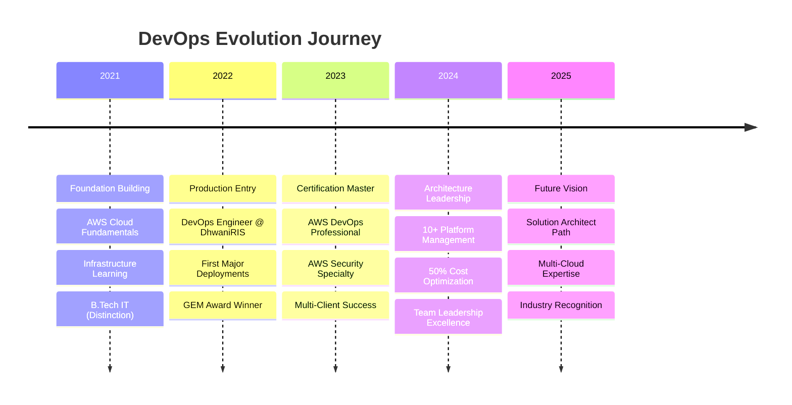

# Ankit Jangir - DevSecOps Engineer

<div align="center">

[](https://git.io/typing-svg)

</div>

## **Mission Statement**
> *"I don't just deploy code—I architect resilient ecosystems that scale from startup dreams to enterprise realities. Every line of Infrastructure as Code I write is a building block toward zero-downtime, cost-optimized, and security-first cloud platforms."*

## **What I Actually Do** *(Beyond the Buzzwords)*

### **Production Wizardry**
- **Infrastructure Whisperer**: Transformed legacy monoliths into cloud-native architectures serving **100K+ users**
- **Cost Optimization Ninja**: Achieved **47-50% AWS cost reduction** without compromising performance
- **Zero-Incident Guardian**: Maintained **99.9% uptime** as production gatekeeper with **zero security breaches**
- **Multi-Account Architect**: Designed AWS Organizations structures for enterprise-grade governance

### **Real Impact, Real Numbers**
```yaml
achievements:
  cost_savings: "₹2.5M+ annually across client portfolio"
  deployment_speed: "60% faster releases with zero rollbacks"
  infrastructure_scale: "500+ AWS resources across 20+ environments"
  team_efficiency: "40% faster onboarding with automated workflows"
  reliability_boost: "70% reduction in production issues"
```

## **Arsenal of Tools**

<details>
<summary><strong>Cloud Platforms</strong> <em>(Click to expand)</em></summary>

```yaml
Primary:
  - AWS: "Organizations, EKS, Lambda, VPC, IAM, Security Hub"
  - Expertise: "Multi-account strategies, cost optimization, security compliance"
  
Secondary:
  - GCP: "Migration strategies, hybrid deployments"
  - Azure: "Cross-cloud integrations"
  - Oracle Cloud: "Enterprise workload transitions"
```
</details>

<details>
<summary><strong>Infrastructure & Automation</strong></summary>

```yaml
Infrastructure_as_Code:
  - Terraform: "Multi-cloud provisioning, state management"
  - CloudFormation: "AWS-native deployments"
  - Helm: "Kubernetes package management"
  
Container_Orchestration:
  - Kubernetes: "Production-grade clusters, auto-scaling"
  - Docker: "Multi-stage builds, security scanning"
  - EKS: "Managed Kubernetes with Fargate"
```
</details>

<details>
<summary><strong>CI/CD & Automation</strong></summary>

```yaml
Pipeline_Tools:
  - Jenkins: "Groovy pipelines, shared libraries"
  - GitHub Actions: "Workflow automation, matrix builds"
  - Bitbucket Pipelines: "Git-integrated deployments"
  
Automation_Philosophy:
  - "If you do it twice, automate it"
  - "Configuration drift is the enemy"
  - "Every deployment should be identical"
```
</details>

<details>
<summary><strong>Observability & Security</strong></summary>

```yaml
Monitoring_Stack:
  - Prometheus + Grafana: "Custom metrics, SLI/SLO tracking"
  - Datadog: "APM, infrastructure monitoring"
  - ELK Stack: "Centralized logging, anomaly detection"
  
Security_Arsenal:
  - AWS Security: "GuardDuty, Inspector, Config Rules"
  - Vulnerability Scanning: "Burp Suite, ZAP, Qualys"
  - Compliance: "SOC2, GDPR, Government standards"
```
</details>

## **Signature Projects**

### **Multi-Tenant Government Platform**
```yaml
Challenge: "Build NIC/DIC compliant infrastructure for national programs"
Solution: 
  - Designed air-gapped VPC architecture
  - Implemented audit logging with CloudTrail + Config
  - Built disaster recovery with cross-region replication
Impact: "100% uptime during critical government operations"
```

### **AI/ML Platform Infrastructure**
```yaml
Challenge: "Scale ML workloads with unpredictable compute demands"
Solution:
  - EKS with Karpenter auto-scaling
  - Spot instances with graceful interruption handling
  - GPU-optimized node pools with taints/tolerations
Impact: "60% cost reduction while supporting 10x model training throughput"
```

### **Enterprise Cost Optimization Engine**
```yaml
Challenge: "Runaway AWS costs across multiple business units"
Solution:
  - Automated resource tagging and cost allocation
  - Reserved Instance recommendation engine
  - Unused resource identification with automated cleanup
Impact: "₹1.8M annual savings with detailed cost attribution"
```

---

## **Professional Journey**

<div align="center">



</div>

---

## 🏆 **Hall of Fame**

<table>
<tr>
<td width="50%">

### 🌟 **Recognition**
- **3x GEM Award Winner** (2022, 2023, 2024)
- **Project Leadership Excellence** - Apna Desh
- **Security & Compliance Champion** - HUF Project

</td>
<td width="50%">

---

### 📜 **Credentials**
- **AWS Certified DevOps Engineer – Professional**
- **AWS Certified Security – Specialty**
- **B.Tech Information Technology** (Distinction)

</td>
</tr>
</table>

---

## **GitHub Analytics**

<div align="center">

<table>
<tr>
<td align="center">

</td>
<td align="center">

</td>
</tr>
<tr>
<td colspan="2" align="center">

</td>
</tr>
</table>

---

### **Contribution Activity**


</div>

## **Let's Build Something Amazing**

<div align="center">

[](https://www.linkedin.com/in/ankit-jangir-devops/)
[](https://github.com/ankitjangir1690)
[](mailto:ankitjangir.1690@gmail.com)
[](https://wa.me/919643389007)

**📍 New Delhi, India** | **🌐 Available for Remote/Hybrid Opportunities**

</div>

## **Random Dev Thoughts**

<div align="center">

*"Infrastructure as Code isn't just about automation—it's about making your 3 AM self thank your 3 PM self for writing that Terraform module properly."*

**⭐ If my work has helped you, consider starring some repos!**  
**🤝 Always open to discussing cloud architecture, DevOps strategies, or that one kubectl command that's driving you crazy.**

</div>

<div align="center">

</div>
